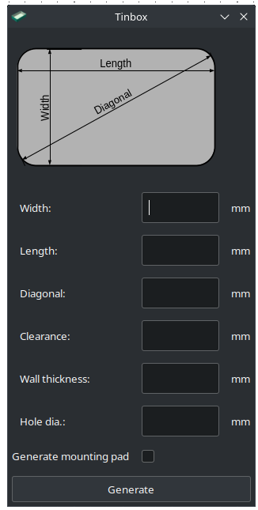
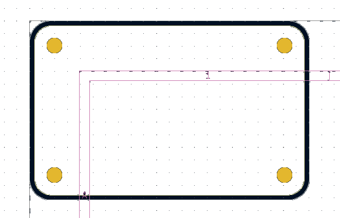
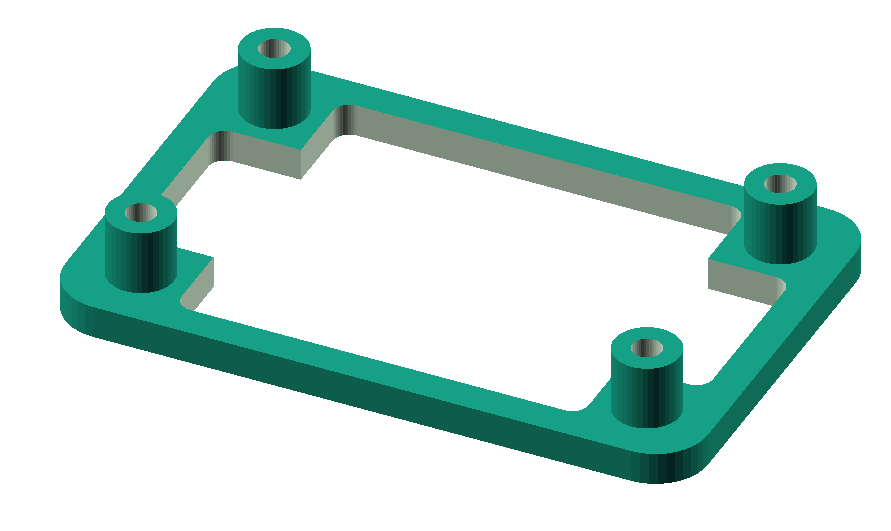

# kicad-tinbox

## Introduction

This repository contains a KiCad Plugin, that shall be installed via KiCad's 
Plugin Manager. See the chapter [Installation](#installation) 

This plugin is designed to create a PCB outline tailored for rounded tin boxes,
such as those used for mint candies. It simplifies the design process by 
automatically calculating the rounded corners based on a few easily measurable
parameters.

Additionally, the plugin offers the option to add four mounting holes
positioned at the corners of the PCB. Users can specify the diameter of mounting
holes required or set the value to 0 if no mounting holes are needed.
You can specify the clearance between the external wall of the box and the PCB outline.

This is the data entry window of the pluging that lists the required input 
measurements: 

Below you can find an example PCB outline that is generated by the plugin:

The plugin can optionally generate an OpenSCAD model of a 3D printable
mounting pad, that can be inserted at the bottom of the box. You need
OpenSCAD to open the file `<pcb_name>_mount.scad` and use the tool to 
generate an STL file for 3D printing. The parameter 'thickness' is needed 
to generate the model, this is the wall thickness of the tin box. 

Below you can find an example mounting pad model that is generated by the plugin:

## Installation

## Prerequisites

Since this is a KiCad plugin, you naturally need KiCad installed on the computer
This plugin supports Kicad 7, and may not work with older KiCad versions.

If you want to use the optionally generated 3D printed mounting pad, then 
you need [OpenSCAD](https://openscad.org/) too. Generating a parameterized STL 
file directly from Python is rather complicated and was generally beyond the
scope of this plugin.

### Using the released Plugin archives 

1. Get the latest release ZIP from the [Releases](https://github.com/molnarkares/kicad-tinbox/releases)
2. Start KiCad and Open the Plugin and Content Manager
3. Use the "Install from File" option to install the plugin from the local archive.

### Using the repository sources

This method is currently supported only on OSes that can execute a 
bash shell script.

1. Clone the repository to a local folder
2. Execute release.sh that will create kicad-tinbox.zip in the root directory 
of the repository.
3. Follow the steps from point 2 of the chapter 
[Using the released Plugin archives](#using-the-released-plugin-archives)  

### Uninstall

To uninstall the plugin follow these steps:
1. Start KiCad and open the Plugin and Content Manager
2. Select the tab 'Installed' on the top of the window
3. Click on Tinbox in the list of installed plugins
4. Click on the Uninstall button right to the plugin name.
5. Click on 'Apply Pending Changes' on the bottom right of the window.

## Usage

The installed plugin is available from the PCB editor, from the Tools->External Plugins
menu. Click on the plugin 'Tinbox PCB Generator' to start it.

### Parameters

The plugin starts at a data entry window, with an explanation drawing on the top.
You shall measure the external sizes of the rounded box, including the
`length`, `width` and `diagonal`. Normally there is a small clearance gap between the 
box wall and the inserted PCB: you can specify this value in the `clearance` field.    
Another value to be specified is the wall thickness, which is the thickness of
wall of the box. In case of a thin sheet metal box it is usually in the range of 
0.5 millimeter.    
The parameter `hole dia` is diameter of the desired mounting holes, or zero 
if no holes shall be placed on the PCB. 
There is a checkbox at the bottom that enables the generation of a 3D printable
PCB mounting pad that fits in the box.

### Mounting Pad

The optionally generated mounting pad is an OpenSCAD model, that consists of two
files: a parameterizable model file that is copied in the project folder under the
name `<pcb_name>_mount.scad` and the generated parameter file under the name
`mounting_pad_cfg.scad`. Note that you need both files, while the repository only
contains the parameterizable template. In order to have the parameter file, you 
need to start the plugin and create a PCB with mounting holes and mounting 
pad generation enabled.

The generated files have .scad extension and were meant to be opened in OpenSCAD.
The basic workflow would be like:

1. Start OpenSCAD
2. Open the file `<pcb_name>_mount.scad` from the KiCad project folder.
3. This should immediately show a draft render of the mounting pad model,
that shall be visually checked for correctness.
4. Hit F6 to update and finalize the rendering. This might take a few seconds.
5. Click on the button 'STL' to generate the 3D printable STL file.
6. Save the STL file and send it to a 3D printer.

