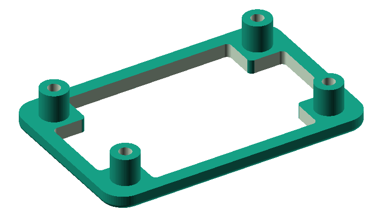

# kicad-tinbox

## Introduction

This plugin is designed to create a PCB outline tailored for rounded tin boxes,
such as those used for mint candies. It simplifies the design process by 
automatically calculating the rounded corners based on a few easily measurable
parameters.

Additionally, the plugin offers the option to add four mounting holes
positioned at the corners of the PCB. Users can specify the diameter of mounting
holes required or set the value to 0 if no mounting holes are needed.
You can specify the clearance between the external wall of the box and the PCB outline.

Below you can find an example mounting pad model that is generated by the plugin:

The plugin can optionally generate an OpenSCAD model of a 3D printable
mounting pad, that can be inserted at the bottom of the box. You need
OpenSCAD to open the file `<pcb_name>_mount.scad` and use the tool to 
generate an STL file for 3D printing. The parameter 'thickness' is needed 
to generate the model, this is the wall thickness of the tin box. 

Below you can find an example mounting pad model that is generated by the plugin:

